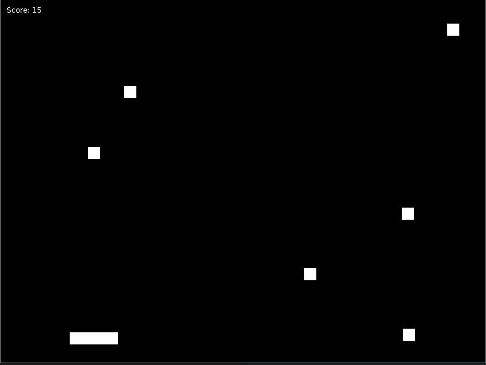

# Catch the Falling Objects

This is a simple game built using the LÖVE 2D game framework where the player controls a basket to catch falling objects. The objective of the game is to catch as many falling objects as possible.

## Controls

- **Left Arrow Key:** Move the basket left.
- **Right Arrow Key:** Move the basket right.

## How to run
- make sure you installed love2D
- download the repo
- open the main.lua file in an editor
- run the file

  
